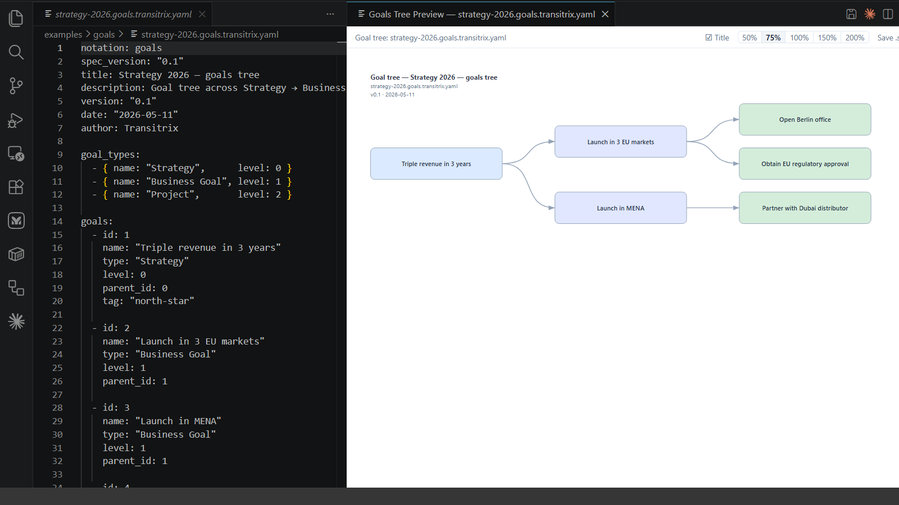

# Transitrix Studio

**Architecture-as-code for the modern enterprise.** Describe your organisation — goals, processes, capabilities, applications, BPMN flows — in plain YAML, and Transitrix Studio renders live diagrams inside VS Code. Review architectural changes like pull requests. Diff them. Version them. Hand them to an AI that actually reads YAML.

## Why text-native architecture?

Diagrams hidden in proprietary binary files don't survive contact with version control. They are hard to diff, hard to review, hard to merge. They drift from the truth they once described.

Transitrix flips that:

- **Your architecture lives in YAML files** — readable in any editor, diffable in git, reviewable in pull requests.
- **Diagrams are derived, not authored** — never out of sync with the source of truth.
- **AI works with it natively** — your assistant can read, edit, and reason about the entire enterprise model without leaving the repo.
- **Built on open standards** — ArchiMate 3.2, BPMN 2.0, CMM. Your investment survives any single tool.

## 13 notations, one extension

| Domain | Notation | Use it for |
|---|---|---|
| Strategy | **Goals tree** | Hierarchical goal decomposition |
| Strategy | **FGCA / FGA** | Factors → goals → (changes →) activities chains |
| Capability | **Capability map** | Current vs target maturity per capability |
| Process | **Process map** | Operating / supporting / management process landscape |
| Process | **Process blueprint** | Stage-by-stage design with systems, actors, equipment, information |
| Process | **BPMN** | Full BPMN 2.0 — YAML-authored, BPMN-rendered |
| Schedule | **Activity network** | PSND / AoN diagrams + Gantt + critical path |
| Risk | **Scenarios** | Scenario planning across factors |
| Catalogue | **Applications** | Applications, integrations, platforms, data stores |
| Catalogue | **Products** | Digital products, services, bundles |
| Decomposition | **Nested blocks** | Recursive block tree |

Every preview ships with a toolbar: title toggle, discrete zoom (50–200%), save as SVG, save as PNG (2× for crisp output), and copy PNG to clipboard (Windows today; macOS / Linux planned).

The preview opens automatically when you open a recognised file and refreshes on every save.

## Pairs well with Mermaid

Transitrix and Mermaid are **complementary, not competing**. Use **Mermaid** for general-purpose diagrams — flowcharts, sequence diagrams, ER, Gantt. Use **Transitrix** for the structured enterprise notations Mermaid doesn't cover. Together: nearly 30 notations at your fingertips, both free and open source.

## Get started in 60 seconds

1. **Install this extension** from the Marketplace.
2. **Clone the starter repo:** `git clone https://github.com/transitrix/methodology`
3. **Open any `.transitrix.yaml` file** under `notations/examples/` — preview opens automatically.

Recognised BPMN file suffixes are configurable in **Settings → Transitrix Studio**.

## Learn more

- 🌐 **Site** — [transitrix.com](https://transitrix.com)
- 📖 **Methodology canon** — [github.com/transitrix/methodology](https://github.com/transitrix/methodology)
- 🧰 **Source & issues** — [github.com/transitrix/transitrix-studio](https://github.com/transitrix/transitrix-studio)
- 📚 **Glossary** — see [`glossary.md`](https://github.com/transitrix/transitrix-studio/blob/main/glossary.md) in the repo root for domain terminology

Open source. MIT licensed. Built by [Valerii Korobeinikov](https://github.com/transitrix).
