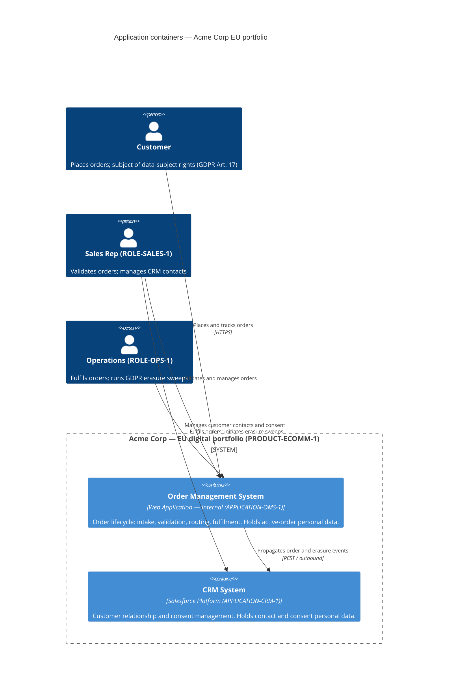

<!--
  Mermaid complementary view — Application layer: software container context.
  Renders in VS Code with Markdown Preview Mermaid Support (bierner.markdown-mermaid).

  Derived from:
    - canon/views/applications/eu-portfolio.applications.transitrix.yaml
        OMS (APPLICATION-OMS-1): Internal, domain=Operations, products=[PRODUCT-ECOMM-1],
          integration outbound REST → CRM (propagates order & erasure events).
        CRM (APPLICATION-CRM-1): Salesforce, domain=Sales, products=[PRODUCT-ECOMM-1].
    - canon/elements/02_business/roles/ — ROLE-SALES-1, ROLE-OPS-1
    - canon/elements/02_business/processes/PROCESS-ORD-FULFILL-1.yaml
        participants referencing ROLE-SALES-1 and ROLE-OPS-1

  Not a duplicate of the Applications catalogue view: the catalogue shows the full
  attribute sheet (lifecycle, vendor, maturity) and the catalogue-wide integration
  descriptor. This C4 container view projects the same systems as a context diagram —
  who uses what, and how containers interconnect.
-->

# Application Containers — Acme Corp EU Portfolio

Application-layer view showing the two software containers that drive the EU portfolio
and how actors interact with them. Derived from the applications catalogue and the
order-fulfilment process participants.

## Model references

| Element | Source |
|---|---|
| `APPLICATION-OMS-1` — Order Management System, Internal | `eu-portfolio.applications.transitrix.yaml` |
| `APPLICATION-CRM-1` — CRM System, Salesforce | `eu-portfolio.applications.transitrix.yaml` |
| `ROLE-SALES-1` — Sales Rep | `canon/elements/02_business/roles/` |
| `ROLE-OPS-1` — Operations | `canon/elements/02_business/roles/` |
| OMS → CRM REST outbound integration | `eu-portfolio.applications.transitrix.yaml` (integrations block) |
| Product boundary `PRODUCT-ECOMM-1` | `canon/elements/02_business/products/PRODUCT-ECOMM-1.yaml` |
