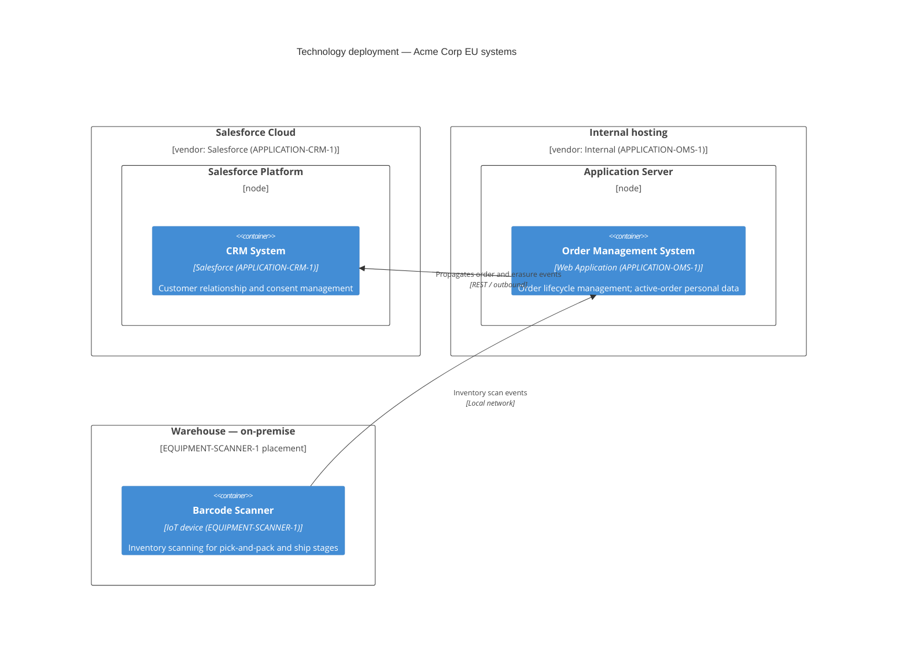

<!--
  Mermaid complementary view — Technology layer: deployment environment.
  Renders in VS Code with Markdown Preview Mermaid Support (bierner.markdown-mermaid).

  Derived from:
    - canon/views/applications/eu-portfolio.applications.transitrix.yaml
        APPLICATION-OMS-1: vendor="Internal" → self-hosted application server.
        APPLICATION-CRM-1: vendor="Salesforce" → Salesforce cloud platform.
        OMS → CRM outbound REST integration.
    - canon/elements/04_technology/equipment/EQUIPMENT-SCANNER-1.yaml
        type: device, description: "Handheld barcode scanner used in the warehouse —
        Pick & pack and Ship stages of the order-fulfilment value chain."

  Deployment zones are derived from element metadata:
    "Salesforce Platform" — from vendor="Salesforce" on APPLICATION-CRM-1.
    "Internal application server" — from vendor="Internal" on APPLICATION-OMS-1.
    "Warehouse (on-premise)" — from EQUIPMENT-SCANNER-1 description and type=device.

  Not a duplicate of the C4 container view: that view shows actors and software
  containers and their interactions. This deployment view projects the same containers
  onto the physical/cloud hosting topology — where each system actually runs.
-->

# Technology Deployment — Acme Corp EU Systems

Technology-layer view of where the EU portfolio applications are deployed. Deployment
zones are derived from vendor metadata and equipment placement recorded in element files.

## Model references

| Deployment node | Derived from |
|---|---|
| Salesforce Cloud | `APPLICATION-CRM-1.vendor: "Salesforce"` in `eu-portfolio.applications.transitrix.yaml` |
| Internal application server | `APPLICATION-OMS-1.vendor: "Internal"` in `eu-portfolio.applications.transitrix.yaml` |
| Warehouse (on-premise) | `EQUIPMENT-SCANNER-1.description` — warehouse context; `type: device` |
| OMS → CRM integration | `eu-portfolio.applications.transitrix.yaml` (integrations block, REST outbound) |
| Scanner → OMS | `EQUIPMENT-SCANNER-1` linked to `PROCESS-ORD-FULFILL-1` pick-and-pack stages |
