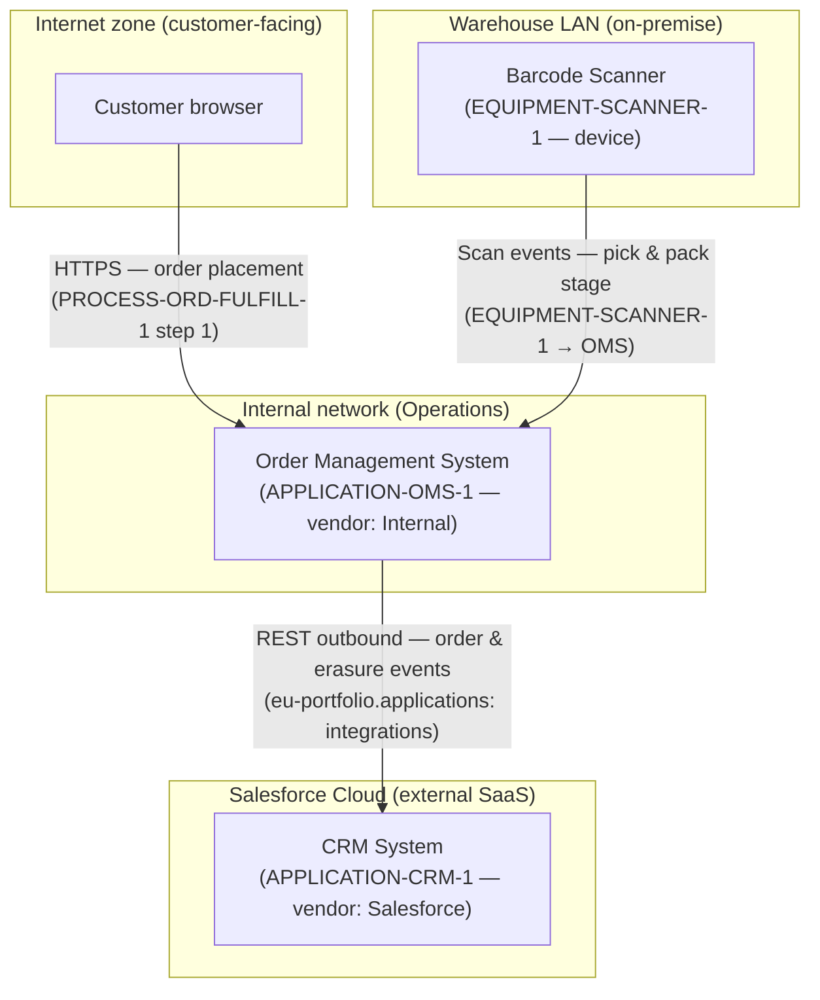

<!--
  Mermaid complementary view — Technology layer: network zone topology.
  Renders in VS Code with Markdown Preview Mermaid Support (bierner.markdown-mermaid).

  Derived from:
    - canon/views/applications/eu-portfolio.applications.transitrix.yaml
        APPLICATION-OMS-1: domain="Operations", vendor="Internal" → internal network zone.
        APPLICATION-CRM-1: domain="Sales", vendor="Salesforce" → external SaaS zone.
        OMS → CRM outbound REST integration → cross-zone channel.
    - canon/elements/04_technology/equipment/EQUIPMENT-SCANNER-1.yaml
        type: device → warehouse local-area network zone.
    - canon/assertions/ASSERTION-ECOMM-GDPR-CONSENT-1.yaml (and siblings)
        subject: PRODUCT-ECOMM-1 → customer-facing internet zone implied.

  Zone topology:
    Internet zone — customer browser reaching the OMS (HTTPS, order placement).
    Internal zone — OMS application server (vendor="Internal").
    Salesforce cloud zone — CRM SaaS (vendor="Salesforce"); OMS integrates outbound.
    Warehouse zone — scanner device on local network, feeds inventory events to OMS.

  Not a duplicate of the C4 deployment view: the deployment view shows hosting nodes
  and container placement. This infrastructure view projects the same systems as a
  network-zone diagram — which zones exist, what traffic crosses zone boundaries, and
  what security surface each connection represents.
-->

# Network Zones — Acme Corp EU Infrastructure

Technology-layer view of the network topology. Zones and cross-zone connections are
derived from application vendor metadata, equipment placement, and process participants.

## Model references

| Zone | Derived from |
|---|---|
| Internet zone | Implied by PRODUCT-ECOMM-1 (digital_product, customer-facing) and GDPR consent assertions |
| Internal network | `APPLICATION-OMS-1.vendor: "Internal"` — self-hosted, Operations domain |
| Salesforce Cloud | `APPLICATION-CRM-1.vendor: "Salesforce"` — external SaaS |
| Warehouse LAN | `EQUIPMENT-SCANNER-1.type: device`; description: warehouse placement |

| Cross-zone connection | Source |
|---|---|
| Internet → Internal (HTTPS) | `PROCESS-ORD-FULFILL-1.flow.steps[0]` — startEvent (customer-initiated) |
| Internal → SaaS (REST) | `eu-portfolio.applications.transitrix.yaml` OMS integrations block |
| Warehouse → Internal (local) | `EQUIPMENT-SCANNER-1` feeds pick-and-pack (`STEP-ORD-FULFILL-4`) |
