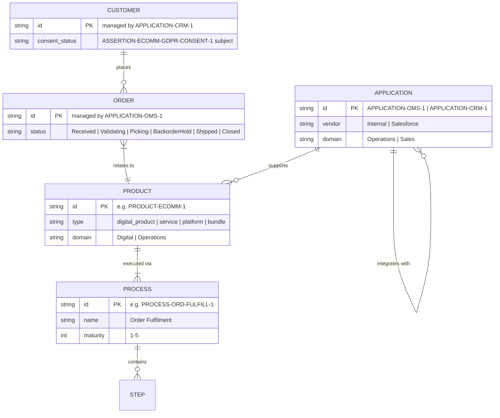

<!--
  Mermaid complementary view — Application layer: core domain entity model.
  Renders in VS Code with Markdown Preview Mermaid Support (bierner.markdown-mermaid).

  Derived from:
    - canon/elements/02_business/products/PRODUCT-ECOMM-1.yaml
        processes: [PROCESS-ORD-FULFILL-1] — Product → Process relationship.
    - canon/elements/03_application/applications/APPLICATION-OMS-1.yaml
        products: [PRODUCT-ECOMM-1] — Application manages Product.
        description: "Core system for the order lifecycle" — OMS entity domain = Orders.
    - canon/elements/03_application/applications/APPLICATION-CRM-1.yaml
        description: "Customer-relationship and consent management" — CRM entity domain = Customers.
    - canon/views/applications/eu-portfolio.applications.transitrix.yaml
        integrations: OMS outbound → CRM (REST) — Application ↔ Application relationship.
    - canon/elements/02_business/processes/PROCESS-ORD-FULFILL-1.yaml
        flow.steps[] — 7 steps → Process contains Steps.
    - canon/assertions/ASSERTION-ECOMM-GDPR-CONSENT-1.yaml
        subject: PRODUCT-ECOMM-1, about: REQUIREMENT-GDPR-CONSENT-1 — consent is a Customer attribute.

  Entity types (CUSTOMER, ORDER, PRODUCT, PROCESS, APPLICATION) correspond to the
  Transitrix TYPE vocabulary used by elements in this repository. Relationships are
  model facts (fields on element files), not inferred business logic.

  Not a duplicate of the Applications catalogue view: the catalogue shows application
  attributes and integrations. This ER view projects the cross-layer domain model —
  how the business domain entities relate across the element graph.
-->

# Domain Entities — Core Model

Application-layer entity-relationship view of the Acme Corp domain model. All
relationships are derived from explicit field values on element files.

## Model references

| Relationship | Source field |
|---|---|
| `CUSTOMER` places `ORDER` | `APPLICATION-CRM-1` domain (Sales/CRM); GDPR assertions on customer subjects |
| `ORDER` relates to `PRODUCT` | `APPLICATION-OMS-1.products: [PRODUCT-ECOMM-1]` |
| `PRODUCT` executed via `PROCESS` | `PRODUCT-ECOMM-1.processes: [PROCESS-ORD-FULFILL-1]` |
| `PROCESS` contains `STEP` | `PROCESS-ORD-FULFILL-1.flow.steps[]` (7 steps) |
| `APPLICATION` supports `PRODUCT` | `APPLICATION-OMS-1.products: [PRODUCT-ECOMM-1]` |
| `APPLICATION` integrates with `APPLICATION` | `eu-portfolio.applications.transitrix.yaml` OMS → CRM outbound REST |
