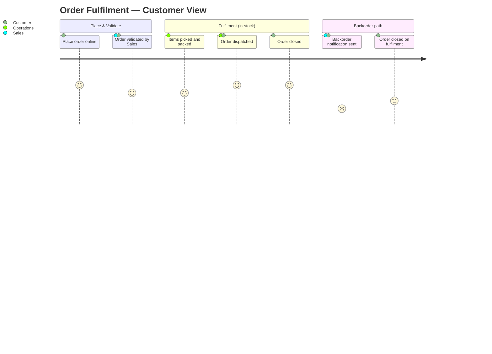

<!--
  Mermaid complementary view — Business layer: customer journey through order fulfilment.
  Renders in VS Code with Markdown Preview Mermaid Support (bierner.markdown-mermaid).

  Derived from:
    - canon/elements/02_business/processes/PROCESS-ORD-FULFILL-1.yaml
        flow.steps[] — the canonical step sequence, including the in-stock / out-of-stock
        gateway (STEP-ORD-FULFILL-3); participants ROLE-SALES-1 (Sales) and
        ROLE-OPS-1 (Operations).

  Not a duplicate of the BPMN or process-map views: those show the process graph from
  the business-analyst / operations perspective. This journey projects the same steps
  as customer experience — phases, actors visible to the customer, satisfaction signal —
  a Business-layer read complementary to the process graph.
-->

# Order Fulfilment — Customer Journey

Business-layer view of the order-fulfilment process as experienced by the customer.
Sections correspond to phases of `PROCESS-ORD-FULFILL-1`; actors are the roles visible
at each phase. Satisfaction scores are derived from the process outcome: the in-stock
path closes at high satisfaction; the backorder branch carries a delayed-fulfilment dip.

## Model references

| Journey phase | Step | Element |
|---|---|---|
| Place order online | `STEP-ORD-FULFILL-1` | startEvent — performed by `ROLE-SALES-1` (Sales) |
| Order validated | `STEP-ORD-FULFILL-2` | userTask "Validate Order" — `ROLE-SALES-1`, `APPLICATION-OMS-1` |
| Routing gateway | `STEP-ORD-FULFILL-3` | exclusiveGateway "In stock?" — `ROLE-OPS-1` |
| Items picked and packed | `STEP-ORD-FULFILL-4` | task "Pick and Pack" — `ROLE-OPS-1`, `APPLICATION-OMS-1` |
| Order dispatched | `STEP-ORD-FULFILL-5` | task "Ship Order" — `ROLE-OPS-1` |
| Backorder notification | `STEP-ORD-FULFILL-6` | userTask "Notify Customer of Backorder" — `ROLE-SALES-1`, `APPLICATION-OMS-1` |
| Order closed | `STEP-ORD-FULFILL-7` | endEvent — `ROLE-OPS-1` |

Process: `PROCESS-ORD-FULFILL-1` · Flow source: `flow.steps[]` + `flow.sequence[]`
