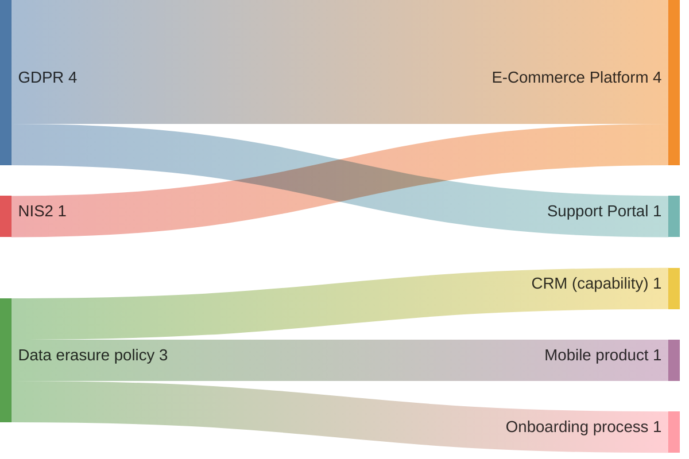

<!--
  Mermaid complementary view — Business layer: compliance-obligation flow by regulation and subject.
  Renders in VS Code with Markdown Preview Mermaid Support (bierner.markdown-mermaid).

  Derived from:
    - canon/assertions/ASSERTION-ECOMM-GDPR-CONSENT-1.yaml       — GDPR × PRODUCT-ECOMM-1
    - canon/assertions/ASSERTION-ECOMM-GDPR-ERASURE-1.yaml        — GDPR × PRODUCT-ECOMM-1
    - canon/assertions/ASSERTION-ECOMM-GDPR-PORTABILITY-1.yaml    — GDPR × PRODUCT-ECOMM-1
    - canon/assertions/ASSERTION-ECOMM-NIS2-INCIDENT-1.yaml       — NIS2 × PRODUCT-ECOMM-1
    - canon/assertions/ASSERTION-SUPPORT-GDPR-ERASURE-1.yaml      — GDPR × PRODUCT-SUPPORT-1
    - canon/assertions/ASSERTION-CRM-DATA-ERASURE-1.yaml          — data erasure × CAPABILITY-V2
    - canon/assertions/ASSERTION-MOBILE-DATA-ERASURE-1.yaml       — data erasure × PRODUCT-MOBILE-1
    - canon/assertions/ASSERTION-ONBOARD-DATA-ERASURE-1.yaml      — data erasure × PROCESS-CUST-ONBOARD-1

  Edge values = assertion count per (regulation, subject) pair.

  Not a duplicate of the compliance-impact view: that view is a native Transitrix
  obligation × subject status matrix (pass/partial/gap per cell). This Sankey
  projects the same data as a flow diagram — how many obligations each regulation
  routes to each subject — giving a volume/weight read of compliance exposure.
-->

# Compliance Obligations — Regulation-to-Subject Flow

Business-layer view of the compliance obligation landscape. Each flow carries the
count of active assertions linking a regulation (or internal policy) to a product,
capability, or process subject.

## Model references

| Source (regulation / policy) | Target (subject) | Count | Assertions |
|---|---|---|---|
| GDPR | E-Commerce Platform (`PRODUCT-ECOMM-1`) | 3 | consent, erasure, portability |
| NIS2 | E-Commerce Platform (`PRODUCT-ECOMM-1`) | 1 | incident reporting |
| GDPR | Support Portal (`PRODUCT-SUPPORT-1`) | 1 | erasure |
| Data erasure policy | CRM (`CAPABILITY-V2`) | 1 | `ASSERTION-CRM-DATA-ERASURE-1` |
| Data erasure policy | Mobile product (`PRODUCT-MOBILE-1`) | 1 | `ASSERTION-MOBILE-DATA-ERASURE-1` |
| Data erasure policy | Onboarding process (`PROCESS-CUST-ONBOARD-1`) | 1 | `ASSERTION-ONBOARD-DATA-ERASURE-1` |

GDPR obligations reference `REQUIREMENT-GDPR-*`; data-erasure policy obligations reference
`REQUIREMENT-DATA-ERASURE-1` (internal policy requirement, not tagged with a regulation prefix).
