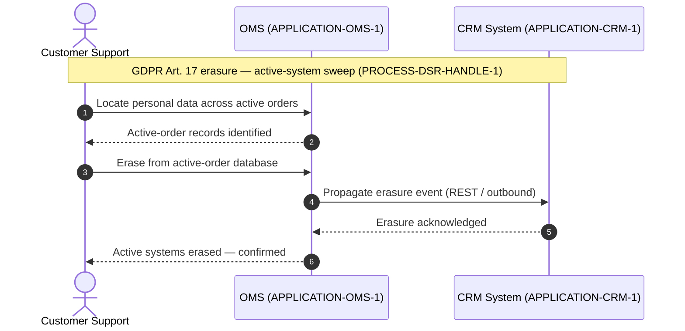

<!--
  Mermaid complementary view — Application layer: application interaction.
  Renders in VS Code with Markdown Preview Mermaid Support (bierner.markdown-mermaid).

  Derived from:
    - canon/views/applications/eu-portfolio.applications.transitrix.yaml
        OMS → CRM outbound REST integration (propagates order and erasure events)
    - canon/views/bpmn/data-subject-erasure.bpmn.transitrix.yaml
        TASK-ERASE-ACTIVE — "Erase from active OMS & CRM"

  Not a duplicate of the BPMN view: the BPMN shows the task flow across
  business lanes (Support / DPO / Ops). This sequence projects the
  application-to-application message exchange at the technical layer.
-->

# Order & GDPR Erasure — Application Interaction

Application-layer view of the GDPR Art. 17 erasure sweep: how the Order
Management System and CRM coordinate once a verified erasure request is in
flight.

The OMS-to-CRM propagation is an explicit model fact — a REST outbound
integration recorded in the applications catalogue
(`eu-portfolio.applications.transitrix.yaml`).

## Model references

| Participant | Element |
|---|---|
| OMS | `APPLICATION-OMS-1` — Order Management System (Operations) |
| CRM | `APPLICATION-CRM-1` — CRM System (Sales) |

| Relationship | Source |
|---|---|
| OMS → CRM, REST outbound, propagates order and erasure events | `eu-portfolio.applications.transitrix.yaml` |
| Erasure step (TASK-ERASE-ACTIVE — "Erase from active OMS & CRM") | `data-subject-erasure.bpmn.transitrix.yaml` |
