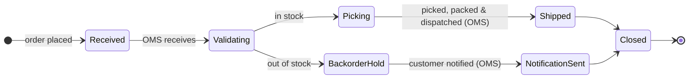

<!--
  Mermaid complementary view — Application layer: order object lifecycle.
  Renders in VS Code with Markdown Preview Mermaid Support (bierner.markdown-mermaid).

  Derived from:
    - canon/elements/02_business/processes/PROCESS-ORD-FULFILL-1.yaml
        flow.steps[] and flow.sequence[] — the canonical order-fulfilment
        process graph, including the in-stock / out-of-stock gateway.
    - canon/elements/03_application/applications/APPLICATION-OMS-1.yaml
        supported_by_application reference on PROCESS-ORD-FULFILL-1 steps
        (STEP-ORD-FULFILL-2 Validate, -4 Pick and Pack, -6 Notify Backorder).

  Not a duplicate of the BPMN view: PROCESS-ORD-FULFILL-1 has no bpmn_file.
  This state diagram projects the order object's lifecycle as managed by
  APPLICATION-OMS-1.
-->

# Order Lifecycle — Application State Machine

Application-layer view of how the Order Management System manages order status
from intake to close-out. States and transitions are derived directly from the
order-fulfilment process graph (`PROCESS-ORD-FULFILL-1.yaml`).

## Model references

| State | Derived from |
|---|---|
| Received | `STEP-ORD-FULFILL-1` — startEvent (Sales) |
| Validating | `STEP-ORD-FULFILL-2` — "Validate Order" (`APPLICATION-OMS-1`) |
| Picking | `STEP-ORD-FULFILL-4` — "Pick and Pack" (`APPLICATION-OMS-1`) |
| BackorderHold | `STEP-ORD-FULFILL-3` gateway, out-of-stock branch |
| Shipped | `STEP-ORD-FULFILL-5` — "Ship Order" |
| NotificationSent | `STEP-ORD-FULFILL-6` — "Notify Customer of Backorder" (`APPLICATION-OMS-1`) |
| Closed | `STEP-ORD-FULFILL-7` — endEvent |

Process: `PROCESS-ORD-FULFILL-1` · OMS application: `APPLICATION-OMS-1`
